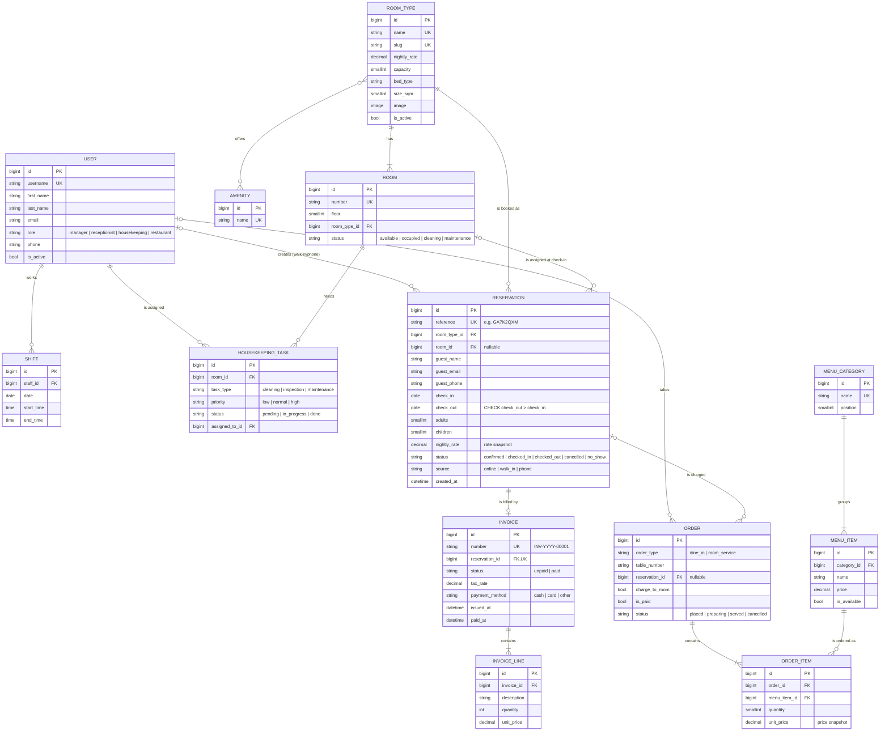
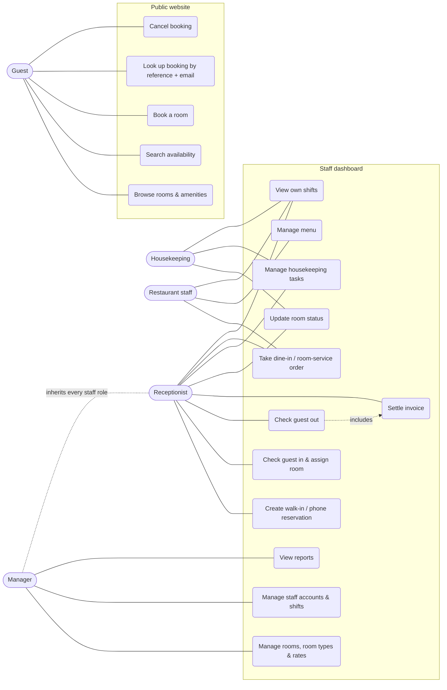
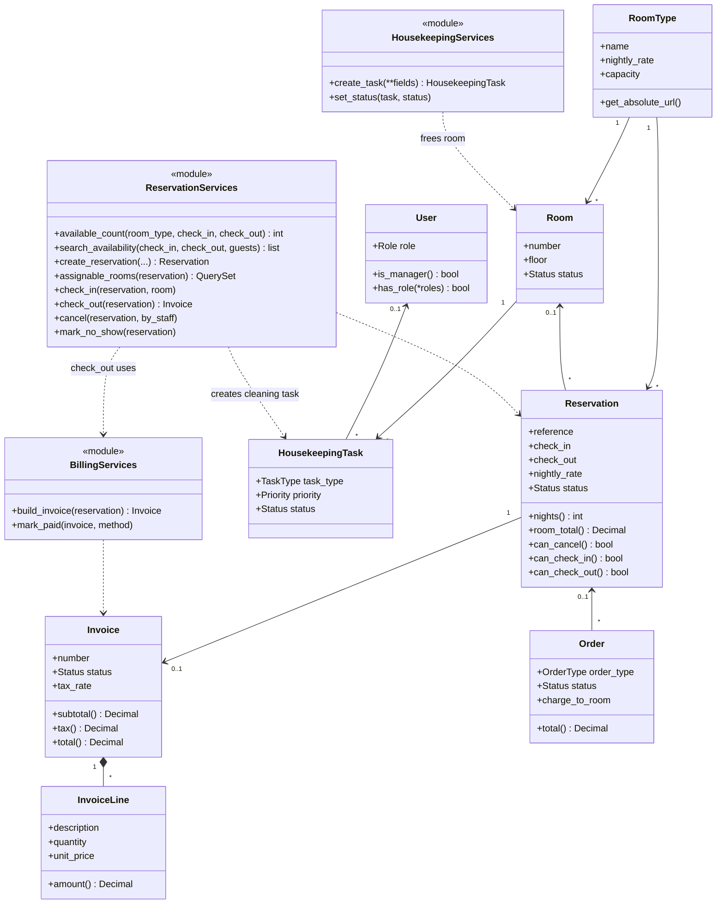
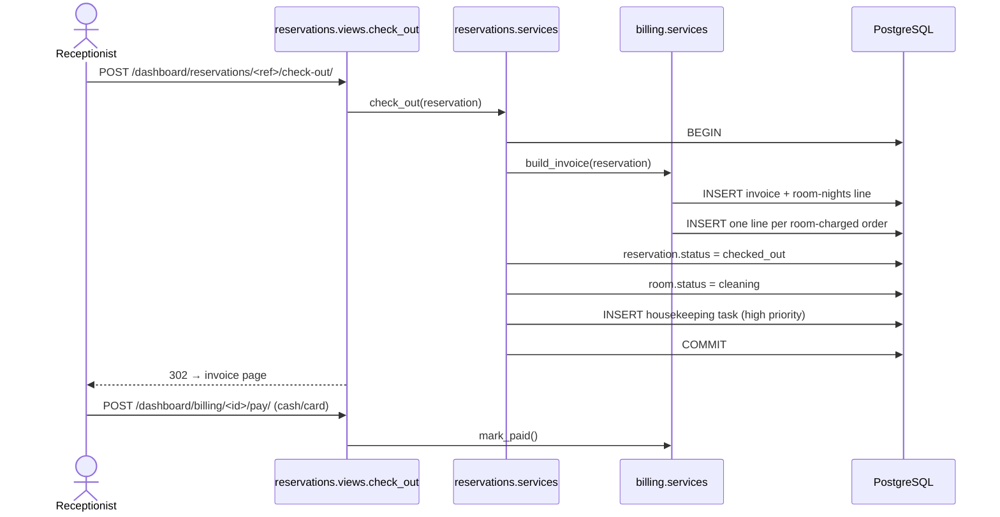
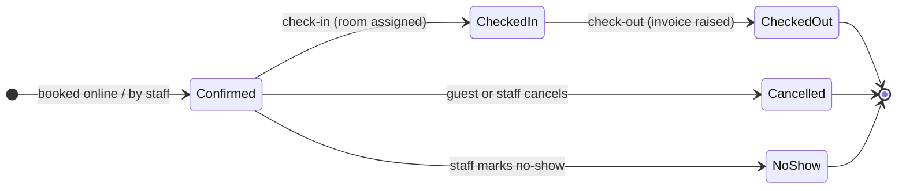
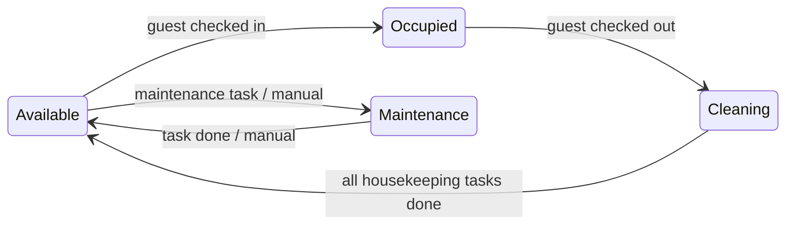

# Diagrams

All diagrams are [Mermaid](https://mermaid.js.org/) — they render directly on GitHub, GitLab and in VS Code
(Markdown Preview Mermaid Support), or paste them into <https://mermaid.live> to export PNG/SVG for the report.

## 1. Entity–relationship diagram



## 2. Use-case diagram



## 3. Class diagram (domain layer)



## 4. Sequence — guest books online

```mermaid
sequenceDiagram
    actor Guest
    participant Web as Website views
    participant Svc as reservations.services
    participant DB as PostgreSQL
    participant Mail as Email backend

    Guest->>Web: GET /search/?check_in&check_out&guests
    Web->>Svc: search_availability()
    Svc->>DB: count rooms & overlapping stays per night
    Web-->>Guest: room types with price and rooms left (HTMX partial)
    Guest->>Web: POST /rooms/<slug>/book/ (guest details)
    Web->>Svc: create_reservation()
    activate Svc
    Svc->>DB: BEGIN; SELECT ... FOR UPDATE on room type
    Svc->>Svc: validate dates, capacity, availability
    alt room still available
        Svc->>DB: INSERT reservation (reference, rate snapshot); COMMIT
        Svc-->>Web: Reservation
        Web->>Mail: confirmation with reference
        Web-->>Guest: 302 → confirmation page
    else sold out meanwhile
        Svc-->>Web: BookingError
        Web-->>Guest: form redisplayed with error
    end
    deactivate Svc
```

## 5. Sequence — check-out



## 6. State diagrams




